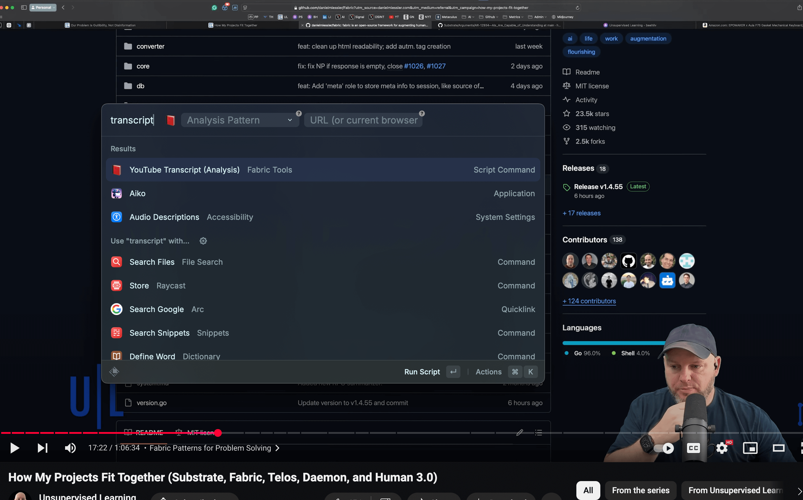

# Raycast Fabric YouTube Analysis

!! This is a proof of concept and will be changing frequently. Please fork it.

A Raycast extension that leverages Fabric AI to analyze YouTube videos, providing transcripts, summaries, and various analysis patterns.



## Overview

This tool integrates Raycast with Fabric AI to provide intelligent analysis of YouTube videos. It can:

- Extract and cache video transcripts
- Apply various AI analysis patterns
- Work with current browser tabs or direct URLs
- Cache results for improved performance

## Prerequisites

- [Go](https://go.dev/doc/install)
- [Fabric](https://github.com/danielmiessler/fabric)
- [Raycast](https://www.raycast.com)
- macOS (for browser integration)

## Installation

1. Install Go from https://go.dev/doc/install
2. Install Fabric:

```bash
go install github.com/danielmiessler/fabric@latest
```

3. Copy the script files to your Raycast Scripts directory
4. Make them executable:

```bash
chmod +x path/to/youtube-transcript-analysis.sh
chmod +x path/to/update-youtube-fabric-patterns.sh
```

## Features

### Main Script (`youtube-transcript-analysis.sh`)

- Fetches YouTube video transcripts
- Applies AI analysis patterns
- Caches results (30 days for transcripts, 7 days for patterns)
- Supports multiple browsers
- Validates YouTube URLs
- Copies results to clipboard

### Pattern Updater (`update-youtube-fabric-patterns.sh`)

- Updates available analysis patterns
- Maintains pattern configurations
- Auto-formats pattern names for display

## Usage

1. Make sure Fabric has a default model set `fabric -d`
1. Make sure you can retrive a YouTube video transcript and analyze it with Fabric `fabric -y https://www.youtube.com/watch?v=wPEyyigh10g | fabric -p extract_wisdom`
1. Open Raycast
1. Run "Update YouTube Raycast Patterns"
1. Run "Reload Script Directories"
1. Type "YouTube Analysis"
1. Choose an analysis pattern (optional)
1. Enter a URL or use current browser tab
1. Results will be copied to clipboard

## Cache Locations

- Transcripts: `~/.cache/raycast/youtube/transcripts`
- Pattern Results: `~/.cache/raycast/youtube/patterns`
- Fabric Patterns: `~/.config/fabric/patterns`

## Error Handling

The scripts handle various error cases:

- Invalid URLs
- Private/unavailable videos
- Timeouts (15s for both transcript and pattern processing)
- Rate limiting
- Missing dependencies

## Troubleshooting

- Ensure Go is installed and in PATH
- Verify Fabric installation: `which fabric`
- Check browser permissions in System Settings
- Review debug output if needed

## Note

This project requires Fabric AI access and proper configuration of the Fabric patterns directory at `~/.config/fabric/patterns`
